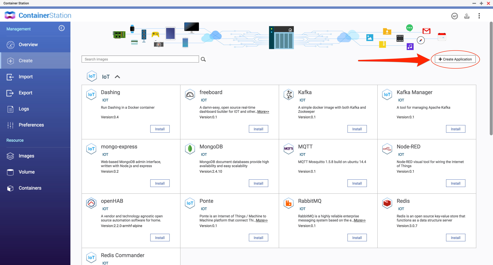
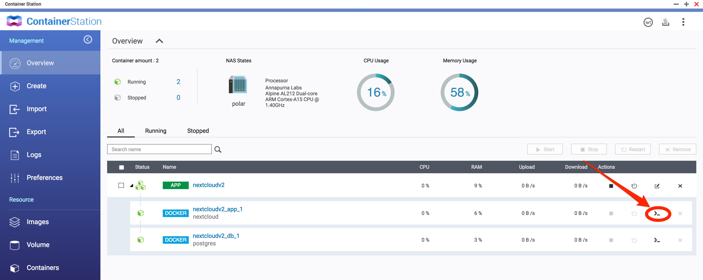

# Nextcloud arm32v7 QNAP
*docker compose file for setting up a nextcloud instance with postgres on arm32v7 qnap.*

* uses postgres as it is available for the arm32v7 architecture
* creates a self signed certificate
---
### steps
1.  login to the webinterface of your NAS and open the container station application to create a new application:



2. copy and past the content of the docker-compose.yml.
3. make sure to set the postgres password in the docker-compose.yml: `POSTGRES_PASSWORD=SUPERSECRETPASSWORD`. if necessary change the port to which the nextcloud container gets exposed to. in this example it is **445** as the default port **443** it occupied by the NAS webinterface.

3. create the application.

4. to access the nextcloud instance via SSL we need to create a self signed certificate. access the shell of the nextcloud container.



activate ssl in apache
```
a2enmod ssl
a2ensite default-ssl
```

create a directory for the certificates and the certificates itself. openssl will ask for some information - make them up or leave them empty.
```
mkdir /etc/apache2/ssl
openssl req -x509 -nodes -days 365 -newkey rsa:2048 -keyout /etc/apache2/ssl/nextcloud.key -out /etc/apache2/ssl/nextcloud.crt
cd ..
```

create the apache config file
```
echo "<VirtualHost *:443>
        ServerAdmin webmaster@localhost
        DocumentRoot /var/www/nextcloud
        ErrorLog ${APACHE_LOG_DIR}/error.log
        CustomLog ${APACHE_LOG_DIR}/access.log combined
        SSLEngine on
        SSLCertificateFile /etc/apache2/ssl/nextcloud.crt
        SSLCertificateKeyFile /etc/apache2/ssl/nextcloud.key
</VirtualHost>" > nextcloud-ssl.conf
```

enable the config and restart apache
```
a2ensite nextcloud-ssl.conf
systemctl restart apache2.service
```

5. now you can access your nextcloud instance via `https://NAS-IP:445`
6. configure your nextcloud instance. when configuring the database use the settings from the docker-compose.yml and as hostname `db`.


----

if you want to use your nextcloud instance from outside your local network i would suggest following this guide: [Docker-Compose with Let's Encrypt and NGINX]( https://github.com/nextcloud/docker/tree/master/.examples/docker-compose
)
